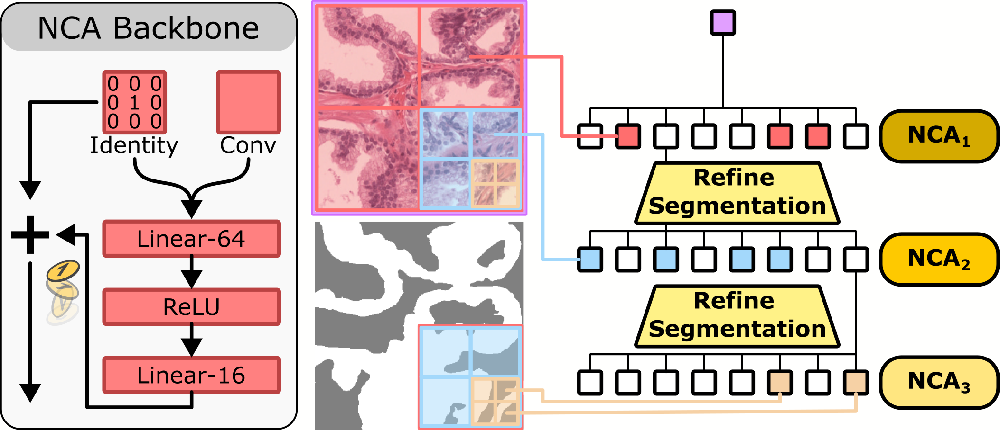

# OctreeNCA: Single-Pass 184 MP Segmentation on Consumer Hardware

This is the official implementation of our paper [OctreeNCA: Single-Pass 184 MP Segmentation on Consumer Hardware](https://arxiv.org/abs/2508.06993) accepted at BMVC 2025.  
Nick Lemke, John Kalkhof, Niklas Babendererde, Anirban Mukhopadhyay



## OctreeNCA implementation

The implementation of our OctreeNCA can be found in [`src/models/Model_OctreeNCA_2d_patching2.py`](src/models/Model_OctreeNCA_2d_patching2.py) and [`src/models/Model_OctreeNCA_3d_patching2.py`](src/models/Model_OctreeNCA_3d_patching2.py)

## CUDA Inference Functions

The CUDA inference functions proposed in our paper can be found in [`nca_cuda.cu`](nca_cuda.cu) and [`nca_cuda3d.cu`](nca_cuda3d.cu). The extensions are compiled with the [`nca_cuda_compile.py`](nca_cuda_compile.py) script. In our case we need to specify the path to the CUDA toolkit installation:

```bash 
CUDA_HOME=/usr/local/cuda-12.4 python nca_cuda_compile.py install
```

## Setup and installation

1. Create a conda environment with ``conda create -n nca python=3.10.14``
2. Set a ``FILER_BASE_PATH`` and ``STUDY_PATH`` in [`src/utils/ProjectConfiguration.py`](src/utils/ProjectConfiguration.py). The results of the training will be stored at ``os.path.join(FILER_BASE_PATH, STUDY_PATH)``
3. Install dependencies (by trial-and-error).

## Visualize and Debug Experiments with Aim Logger
1. Navigate to the output folder specified in [`src/utils/ProjectConfiguration.py`](src/utils/ProjectConfiguration.py).
2. Enter the subfolder ``Aim``. 
3. Run ``aim up``.
4. Open the displayed URL in your browser to view the training results.

## Usage
Each model + dataset combination has its own training script that loads and combines the corresponding configurations and starts the correct experiment. These script's names start with `train_`. You can change the `experiment.name` identifier to create new experiments or load existing ones. Also, you can tweak the configuration within this file for quick prototyping.

## Preprocessing
The radiology and pathology data do not require any preprocessing. 
The surgical videos are preprocessed using the [`preprocess_cholecSeg8k.ipynb`](preprocess_cholecSeg8k.ipynb) notebook.


## Scripts for Creating the Figures


| | Content | Main script | Additional scripts (e.g. for  training) |
|-|-|-|-|
|4|Pathology|``figure_peso.ipynb``|``train_peso_med.py``, ``train_peso_min_unet.py``, ``train_peso_sam.py``, ``train_peso_segformer.py``, ``train_peso_unet.py``, ``train_peso.py``|
|4|Surgery|``figure_cholec.ipynb``|``train_cholecSeg.py``, ``train_cholecSeg_unet.py``, ``train_cholecSeg_sam2.py``, ``train_cholecSeg_min_unet_3d.py``, ``train_cholecSeg_m3d.py``|
|4|Radiology|``figure_prostate.ipynb``|``train_prostate2.py``, ``train_prostate_unet_3d.py``, ``train_prostate_min_unet_3d.py``, ``train_prostate_m3d.py``|
|5|Pathology Qualitative|``eval_peso.ipynb``|``patchwise_inference_peso_unet.py``, ``train_peso_unet.py``, ``train_peso.py``|
|6|VRAM|``figure_vram_inference.ipynb``|``inference_pathology_unet_gpu_vram.py``, ``inference_pathology_oct_gpu_vram.py``, ``inference_pathology_m3d_gpu_vram.py``, ``test_segformer.py, test_transunet.py``|
|6|Raspberry Pi|``figure_raspi_runtime.ipynb``|``pi_measure_med.py``, ``pi_measure_oct.py``, ``pi_measure_unet.py``|
|7|CUDA vs. traditional|``figure_single_nca_step.ipynb``|-|
|8|Function vs. local|``inference2_cholec_oct.py``|-|
|9|Radiology Qualitative|``figure_qualitative_prostate.ipynb``|``train_prostate2.py``, ``train_prostate_unet_3d.py``, ``train_prostate_min_unet_3d.py``, ``train_prostate_m3d.py``|
|10|Pathology Qualitative|``eval_peso.ipynb``|``patchwise_inference_peso_unet.py``, ``inference2_peso_oct.py``|
|11|Surgery Qualitative|``figure_qualitative_cholec.ipynb``|``train_cholecSeg.py``, ``train_cholecSeg_unet.py``, ``train_cholecSeg_m3d.py``|

## Scripts for Creating the Tables

| | Content | Main script | Additional scripts (e.g. for  training) |
|-|-|-|-|
|2|Large-scale inference|-|``inference2_cholec_m3d.py``, ``inference2_cholec_oct.py``, ``inference2_cholec_unet.py``, ``inference2_peso_m3d.py``, ``inference2_peso_oct.py``, ``inference2_peso_unet.py``|
|3|Ablations|``table_ablation.ipynb``|``train_prostate2.py``, ``train_cholecSeg.py``, ``train_peso.py``|
|4|M3D-NCA vs OctreeNCA|``table_num_level.ipynb``|``train_prostate2.py``, ``train_prostate_m3d.py``|
|5|Radiology|``table_prostate.ipynb``|``train_prostate2.py``, ``train_prostate_unet_3d.py``, ``train_prostate_min_unet_3d.py``, ``train_prostate_m3d.py``|
|6|Pathology|``table_peso.ipynb``|``train_peso_med.py``, ``train_peso_min_unet.py``, ``train_peso_sam.py``, ``train_peso_segformer.py``, ``train_peso_unet.py``, ``train_peso.py``|
|7|Surgery|``table_cholec.ipynb``|``train_cholecSeg.py``, ``train_cholecSeg_unet.py``, ``train_cholecSeg_sam2.py``, ``train_cholecSeg_min_unet_3d.py``, ``train_cholecSeg_m3d.py``|
|8|Raspberry Pi|``table_timing_pi.ipynb``|``figure_raspi_runtime.ipynb``|``pi_measure_med.py``, ``pi_measure_oct.py``, ``pi_measure_unet.py``|


## Citing OctreeNCA
If you use OctreeNCA in your research, please include the following BibTeX entry.
```
@article{lemke2025octreencasinglepass184mp,
        title={OctreeNCA: Single-Pass 184 MP Segmentation on Consumer Hardware}, 
        author={Nick Lemke and John Kalkhof and Niklas Babendererde and Anirban Mukhopadhyay},
        year={2025},
        eprint={2508.06993},
        archivePrefix={arXiv},
        primaryClass={cs.CV},
        url={https://arxiv.org/abs/2508.06993}, 
}
```